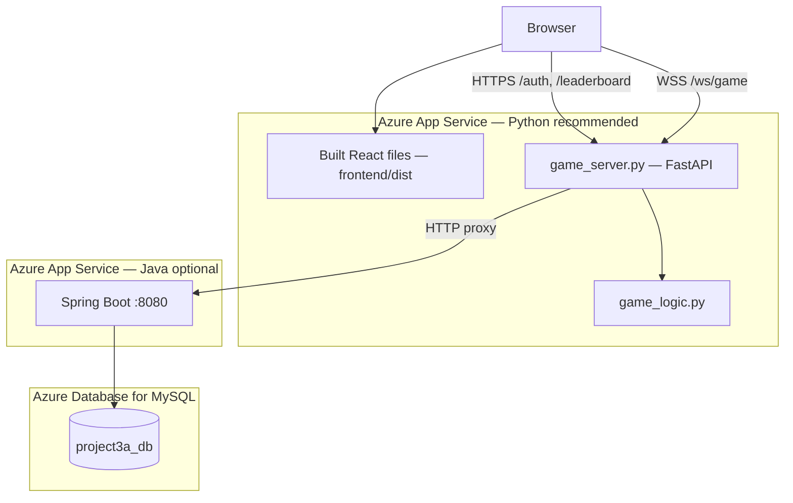

# Deploying Project 3a (Fred the Fish) on Azure

This guide explains how to host the **web version** of the project on Microsoft Azure. The browser UI lives in `frontend/`, but **game logic still runs in Python** (`game_logic.py` via `game_server.py`). Login and leaderboard data come from the **Spring Boot + MySQL** stack in this repo (or another host you configure).

---

## Architecture



| Component | Technology | Role |
|-----------|------------|------|
| UI | React + Vite (`frontend/`) | Menus, auth forms, canvas that **draws** frames from the server |
| Game API | FastAPI (`src/game_server.py`) | WebSocket game sessions, proxies auth/leaderboard |
| Game engine | Python (`src/game_logic.py`) | Physics, obstacles, scoring (unchanged from CLI) |
| Accounts | Spring Boot + MySQL | Register, login, high scores |

**Important:** The React app does **not** reimplement the game in JavaScript. It only displays JSON frames and sends `flap` / `quit` over WebSocket.

---

## Local development (reference)

| Terminal | Command |
|----------|---------|
| 1 | `cd src && source ../.venv/bin/activate && uvicorn game_server:app --port 8765 --reload` |
| 2 | `cd frontend && npm install && npm run dev` |

Vite’s dev proxy (`frontend/vite.config.ts`) forwards `/auth`, `/leaderboard`, and `/ws` to port 8765. **That proxy does not exist in production** — you must serve the built UI and API from the same origin, or configure explicit API URLs.

Optional local auth stack:

```bash
docker compose --profile dev up
```

Spring on `http://localhost:8080`, MySQL on `3306`.

---

## Deployment options on Azure

| Option | Best for | Services |
|--------|----------|----------|
| **A — Single Python App Service** (recommended) | Class projects, simplest URL | 1× App Service (Python) serves API + `frontend/dist` |
| **B — Split frontend + API** | Larger teams | Azure Static Web Apps + Python App Service |
| **C — Containers** | Docker-first workflows | Azure Container Apps or App Service for Containers |

This document focuses on **Option A** plus **Spring Boot + Azure MySQL** for accounts.

---

## Prerequisites

- [Azure account](https://azure.microsoft.com/free/) (student credits: [Azure for Students](https://azure.microsoft.com/free/students/))
- [Azure CLI](https://learn.microsoft.com/en-us/cli/azure/install-azure-cli) (`az login`)
- [Node.js 20+](https://nodejs.org/) (build frontend)
- Python 3.11 or 3.12 (matches App Service runtime)
- Java 21 + Gradle (build Spring JAR, if self-hosting auth)
- Git repo pushed to GitHub (optional, for Deployment Center)

---

## Before you deploy: required code changes

The repo is set up for **local dev**. Apply these changes once before Azure (or keep them on a `deploy` branch).

### 1. Configurable auth API URL

`src/auth.py` currently hardcodes the course server:

```python
BASE_URL = "http://cs506x3a.cs.wisc.edu:8080/api/players"
```

Replace with an environment variable:

```python
import os

BASE_URL = os.environ.get(
    "AUTH_API_URL",
    "http://cs506x3a.cs.wisc.edu:8080/api/players",
)
```

On Azure, set **Application setting**:

```text
AUTH_API_URL=https://<your-spring-app>.azurewebsites.net/api/players
```

Use `http://` only if Spring is not behind HTTPS (not recommended in production).

### 2. Serve the built React app from FastAPI

After `npm run build`, mount `frontend/dist` in `src/game_server.py`:

```python
from fastapi.staticfiles import StaticFiles
from fastapi.responses import FileResponse

FRONTEND_DIST = Path(__file__).resolve().parent.parent / "frontend" / "dist"

# ... after all API routes (auth, leaderboard, websocket) ...

if FRONTEND_DIST.is_dir():
    app.mount("/assets", StaticFiles(directory=FRONTEND_DIST / "assets"), name="assets")

    @app.get("/{full_path:path}")
    def serve_spa(full_path: str):
        """SPA fallback: return index.html for client-side routes."""
        file_path = FRONTEND_DIST / full_path
        if file_path.is_file():
            return FileResponse(file_path)
        return FileResponse(FRONTEND_DIST / "index.html")
```

Order matters: register `/auth`, `/leaderboard`, and `/ws/game` **before** the catch-all `/{full_path:path}` route.

### 3. Production startup command

App Service sets `PORT` (often `8000`). Use:

```bash
cd src && uvicorn game_server:app --host 0.0.0.0 --port ${PORT:-8000}
```

Or from repo root if `PYTHONPATH` includes `src`:

```bash
uvicorn game_server:app --host 0.0.0.0 --port ${PORT:-8000} --app-dir src
```

---

## Build artifacts locally

From the repository root:

```bash
# 1. Frontend production bundle
cd frontend
npm ci
npm run build
cd ..

# 2. Verify dist exists
ls frontend/dist/index.html

# 3. (Optional) Spring Boot JAR for auth backend
./gradlew bootJar
# Output: build/libs/project3a-0.0.1-SNAPSHOT.jar (name may vary)
```

---

## Part 1 — Azure Database for MySQL

1. Portal → **Create a resource** → **Azure Database for MySQL flexible server**.
2. Choose a region, SKU (Burstable B1ms is fine for demos), and set admin username/password.
3. Create database `project3a_db` (or use the default and note the name).
4. **Networking:** allow Azure services; add your client IP for debugging.
5. Note the hostname: `<server-name>.mysql.database.azure.com`.

Connection string pattern for Spring:

```text
jdbc:mysql://<server-name>.mysql.database.azure.com:3306/project3a_db?useSSL=true&requireSSL=true&serverTimezone=UTC
```

Username format for Azure MySQL: `adminuser@<server-name>`.

---

## Part 2 — Spring Boot (auth / leaderboard)

### Create Java App Service

```bash
az group create --name rg-fred-fish --location eastus

az appservice plan create \
  --name plan-fred-fish-java \
  --resource-group rg-fred-fish \
  --sku B1 \
  --is-linux

az webapp create \
  --resource-group rg-fred-fish \
  --plan plan-fred-fish-java \
  --name <unique-spring-app-name> \
  --runtime "JAVA:21-java21"
```

### Configure application settings

In Portal → App Service → **Configuration** → **Application settings**, add:

| Name | Example value |
|------|----------------|
| `SPRING_DATASOURCE_URL` | `jdbc:mysql://...` (see above) |
| `SPRING_DATASOURCE_USERNAME` | `admin@myserver` |
| `SPRING_DATASOURCE_PASSWORD` | *(secret)* |
| `SPRING_DATASOURCE_DRIVER_CLASS_NAME` | `com.mysql.cj.jdbc.Driver` |
| `SPRING_JPA_HIBERNATE_DDL_AUTO` | `update` (demo only; use migrations in production) |

Deploy the JAR via **Deployment Center** (GitHub Actions / ZIP) or:

```bash
az webapp deploy \
  --resource-group rg-fred-fish \
  --name <unique-spring-app-name> \
  --src-path build/libs/project3a-0.0.1-SNAPSHOT.jar \
  --type jar
```

Test: `https://<unique-spring-app-name>.azurewebsites.net/api/players` (or your REST base path).

---

## Part 3 — Python game server + React UI (Option A)

### Create Python App Service

```bash
az appservice plan create \
  --name plan-fred-fish-python \
  --resource-group rg-fred-fish \
  --sku B1 \
  --is-linux

az webapp create \
  --resource-group rg-fred-fish \
  --plan plan-fred-fish-python \
  --name <unique-python-app-name> \
  --runtime "PYTHON:3.12"
```

### Required App Service settings

| Setting | Value |
|---------|--------|
| **Startup command** | `cd src && uvicorn game_server:app --host 0.0.0.0 --port $PORT` |
| **WEBSITES_PORT** | `8000` (if needed; match uvicorn port) |
| **SCM_DO_BUILD_DURING_DEPLOYMENT** | `true` (if deploying source and using Oryx build) |
| **AUTH_API_URL** | `https://<unique-spring-app-name>.azurewebsites.net/api/players` |

Portal → **Configuration** → **General settings**:

- **Web sockets:** On (required for `/ws/game`)

### Deploy code

**ZIP deploy** (include `src/`, `frontend/dist/`, `requirements`):

```bash
# From repo root, after npm run build and code changes above
zip -r deploy.zip src frontend/dist \
  -x "src/__pycache__/*" -x "src/**/__pycache__/*"

az webapp deploy \
  --resource-group rg-fred-fish \
  --name <unique-python-app-name> \
  --src-path deploy.zip \
  --type zip
```

Ensure App Service can install Python deps. Either:

- Add `requirements.txt` at deploy root and set **Startup command** to install then run, or  
- Use a **Dockerfile** (below) for reproducible builds.

**GitHub Actions:** connect Deployment Center to your repo; set app root to repository root; add a workflow step that runs `npm ci && npm run build` in `frontend/` before publishing.

### Verify

1. Open `https://<unique-python-app-name>.azurewebsites.net` — main menu loads.
2. **Play Game** — canvas updates (WebSocket).
3. **Register / Log In** — hits Python → Spring → MySQL.
4. **Leaderboard** — lists players from Spring.

---

## Optional: Dockerfile (single container)

Create `Dockerfile.web` at repo root for Container Apps or App Service container:

```dockerfile
# Build frontend
FROM node:20-alpine AS frontend-build
WORKDIR /app/frontend
COPY frontend/package.json frontend/package-lock.json ./
RUN npm ci
COPY frontend/ ./
RUN npm run build

# Python runtime
FROM python:3.12-slim
WORKDIR /app
COPY src/requirements.txt src/requirements.txt
RUN pip install --no-cache-dir -r src/requirements.txt
COPY src/ src/
COPY --from=frontend-build /app/frontend/dist frontend/dist
ENV PORT=8000
EXPOSE 8000
CMD ["uvicorn", "game_server:app", "--host", "0.0.0.0", "--port", "8000", "--app-dir", "src"]
```

Build and push to **Azure Container Registry**, then deploy to **Container Apps** with WebSocket ingress enabled and env `AUTH_API_URL` set.

---

## Option B — Azure Static Web Apps + separate API

Use this if you want the UI on a CDN and the API on another hostname.

1. Deploy Python App Service as in Part 3 (API only; skip static mount if you prefer).
2. Create **Static Web App** linked to `frontend/` folder.
3. Add `frontend/staticwebapp.config.json`:

```json
{
  "navigationFallback": {
    "rewrite": "/index.html"
  },
  "routes": [
    { "route": "/auth/*", "rewrite": "https://<unique-python-app-name>.azurewebsites.net/auth/*" },
    { "route": "/leaderboard", "rewrite": "https://<unique-python-app-name>.azurewebsites.net/leaderboard" },
    { "route": "/ws/*", "rewrite": "https://<unique-python-app-name>.azurewebsites.net/ws/*" }
  ]
}
```

4. Update `useGameSocket.ts` if the API host differs from the SWA host (may need `wss://<api-host>/ws/game` instead of `location.host`).

Option A avoids this complexity.

---

## Environment variables summary

| Variable | Where | Purpose |
|----------|--------|---------|
| `AUTH_API_URL` | Python App Service | Spring Boot player API base URL |
| `SPRING_DATASOURCE_*` | Java App Service | MySQL connection |
| `PORT` | Python (set by Azure) | Uvicorn listen port |

---

## CI/CD outline (GitHub Actions)

1. **On push to `main`:**
   - `npm ci && npm run build` in `frontend/`
   - Deploy to Python App Service (ZIP or `azure/webapps-deploy`)
2. **Separate workflow or job** for Spring JAR → Java App Service.
3. Store secrets in GitHub: `AZURE_CREDENTIALS`, DB password, `AUTH_API_URL`.

---

## Troubleshooting

| Symptom | Likely cause | Fix |
|---------|----------------|-----|
| Blank page at root | `frontend/dist` not deployed or static routes missing | Run `npm run build`; add FastAPI static mount |
| “Connecting to game server…” forever | WebSockets off or wrong URL | Enable WebSockets; check browser Network tab for `wss://.../ws/game` |
| Login returns “Cannot reach server” (`code: -99`) | `AUTH_API_URL` wrong or Spring down | Fix env var; test Spring URL directly |
| Game runs, auth fails | Python OK, Spring/MySQL issue | Check Java App Service logs, firewall, JDBC URL |
| Works locally, fails on Azure | Vite proxy not used in prod | Use Option A (same origin) |
| CORS errors | UI and API on different hosts | Prefer single App Service or configure CORS + explicit API URL |

**Logs:**

```bash
az webapp log tail --resource-group rg-fred-fish --name <unique-python-app-name>
az webapp log tail --resource-group rg-fred-fish --name <unique-spring-app-name>
```

---

## Cost and security notes

- **B1** App Service plans are typical for demos (~low monthly cost per app).
- **Azure Database for MySQL** is usually the main ongoing cost; review pricing before leaving resources running.
- Do not commit passwords or connection strings; use App Service **Application settings** or **Key Vault**.
- The default `AUTH_API_URL` points at the UW course server — replace with **your** Spring deployment for a personal portfolio.
- Use HTTPS only in production; WebSockets will use `wss://` automatically when the page is served over HTTPS.

---

## Quick checklist

- [ ] `npm run build` produces `frontend/dist`
- [ ] `auth.py` reads `AUTH_API_URL`
- [ ] `game_server.py` serves `frontend/dist` (SPA fallback)
- [ ] Spring Boot deployed with MySQL connection settings
- [ ] Python App Service: WebSockets enabled, startup command set
- [ ] `AUTH_API_URL` points to your Spring app HTTPS URL
- [ ] Test play, login, and leaderboard in the browser

---

## What stays on your laptop

The **terminal CLI** (`src/main.py`) is unchanged and does not need Azure unless you want to SSH into a VM. Azure hosting described here is for the **browser + `game_server.py`** path.

For questions about React vs Python responsibilities, see the architecture section at the top of this document.
