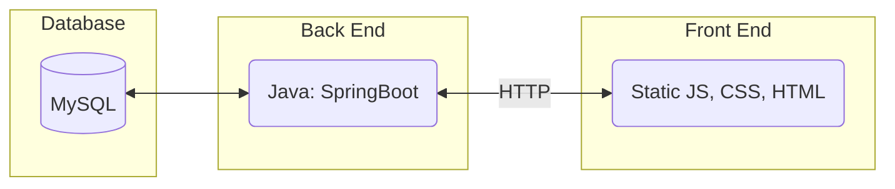
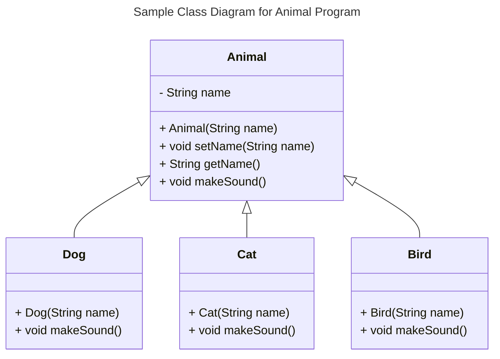
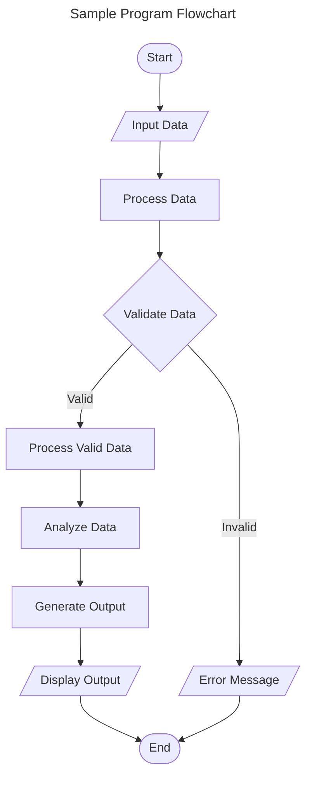
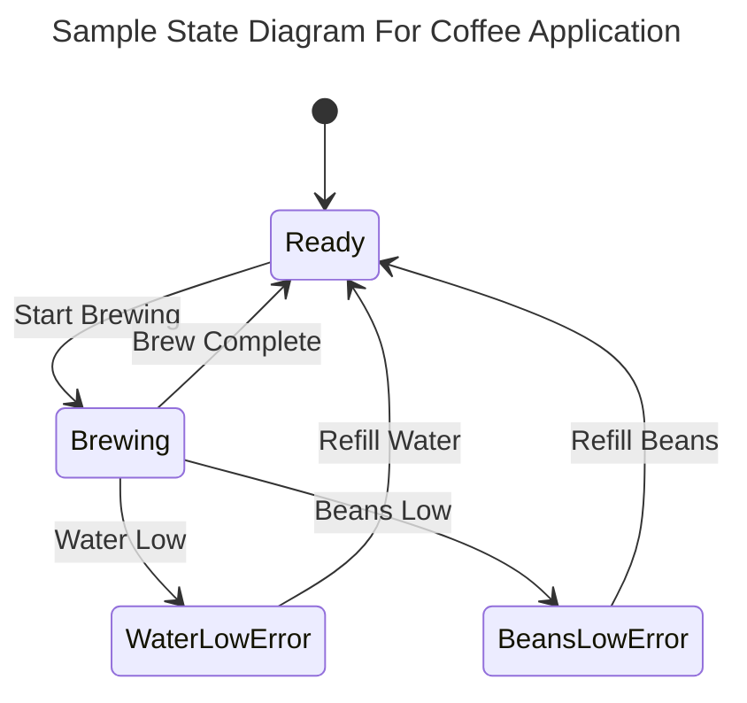
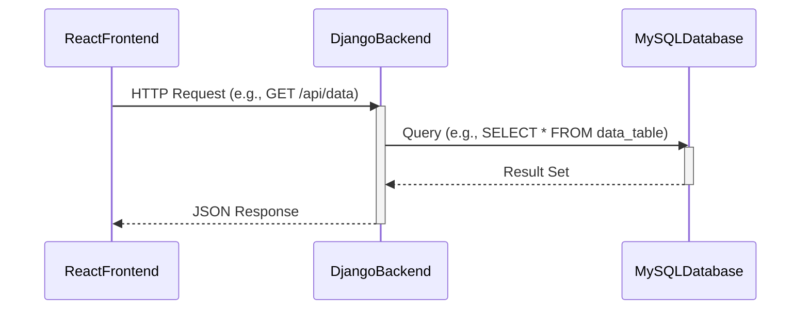

# Specification Document

Please fill out this document to reflect your team's project. This is a living document and will need to be updated regularly. You may also remove any section to its own document (e.g. a separate standards and conventions document), however you must keep the header and provide a link to that other document under the header.

Also, be sure to check out the Wiki for information on how to maintain your team's requirements.

## Team 3A

<!--The name of your team.-->

### Project Abstract

<!--A one paragraph summary of what the software will do.-->

Project description provided by course staff:  Players will navigate Fred the Fish through a series of underwater obstacles, using simple keyboard controls, where points are awarded the longer obstacles are avoided. Your task will include designing the game mechanics and creating ASCII art representations of the undersea environment  ([here]("https://github.com/schromya/FroggySecurity/blob/main/demo.gif") is an example of basic command-line ASCII art). Additionally, you will implement player accounts which enables a leaderboard system where players can view and compete for top scores.

### Customer

<!--A brief description of the customer for this software, both in general (the population who might eventually use such a system) and specifically for this document (the customer(s) who informed this document). Every project will have a customer from the CS506 instructional staff. Requirements should not be derived simply from discussion among team members. Ideally your customer should not only talk to you about requirements but also be excited later in the semester to use the system.-->

The customers for this software would be people who would want a fun game to play, and people who want to compete against others and their own scores.

### Specification

<!--A detailed specification of the system. UML, or other diagrams, such as finite automata, or other appropriate specification formalisms, are encouraged over natural language.-->

<!--Include sections, for example, illustrating the database architecture (with, for example, an ERD).-->

<!--Included below are some sample diagrams, including some example tech stack diagrams.-->

#### Technology Stack




#### Database

```mermaid
---
title: Draft Database Objects
---

    User {
        int user_id
        string name
        string password
        int high_score
    }

```

#### Class Diagram



#### Flowchart



#### Behavior



#### Sequence Diagram



### Standards & Conventions

<!--This is a link to a seperate coding conventions document / style guide-->
[Style Guide & Conventions](STYLE.md)
