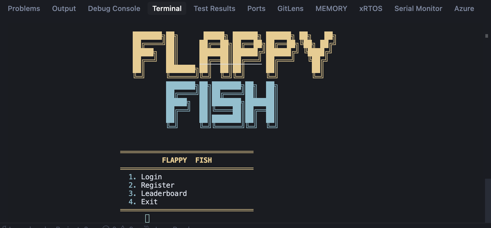
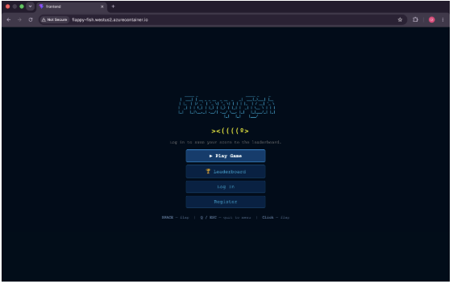

# From Terminal to Browser: Porting a Python Game to React

The project began as a Python terminal game built around ASCII rendering, keyboard input, and a simple backend for accounts and high scores. It worked well in its original environment, but I wanted to make it accessible in the browser while using the opportunity to learn React. Rather than rewriting the entire game in JavaScript, I kept the existing Python engine and focused on building a web interface that could interact with it cleanly.



---

## Building the React frontend

The React frontend was structured around the existing login, registration, leaderboard, and game screen UI components. The key architectural choice was to avoid duplicating game logic. Instead, the browser connected to a Python service over WebSockets and received pre-computed frames from the server.

The Python engine, originally designed for terminal output, was extended with a **headless mode** that produced JSON representations of each frame. React’s responsibility was limited to drawing those frames and communicating with the user.

```text
Browser  →  WebSocket  →  Python game loop  →  JSON frames  →  React canvas
```

---

## Splitting the backend

Supporting this required splitting backend responsibilities across two Python services:

| Service | Role |
|---------|------|
| **Flask** | REST endpoints for auth and leaderboards → Azure SQL via pyodbc |
| **FastAPI** | WebSocket game sessions; forwards auth requests to Flask |

Flask is built for synchronous request/response patterns, while FastAPI is built around asynchronous, long-lived connections like WebSockets. Splitting the work between them felt like the right call from an architecture perspective.

---

## The Azure SQL cold-start surprise

One of the more unexpected challenges came from **Azure SQL’s serverless auto-pause behavior**. Because the Flask API opened a new database connection for each request, the first request after a period of inactivity consistently failed while the database resumed from a paused state. The delay exceeded the client’s timeout, creating the appearance of random failures.

Adding retry logic and adjusting timeouts resolved the issue, but it highlighted how cloud service behavior can influence application design—even when your code looks fine on paper.

---

## Docker lessons

Containerization introduced its own set of lessons:

- **ODBC on Linux** — Building the Python services required Microsoft’s ODBC Driver 18, which meant using Debian-based images rather than Alpine.
- **Build context vs. Dockerfile paths** — `COPY` instructions resolve paths relative to the **build context**, not the Dockerfile’s location. My initial builds happened to work because I was running them from inside each service’s directory, so the files I referenced were accidentally inside the context—even though the paths in the Dockerfile were technically wrong.
- **The real break** — The problem only surfaced once I switched to building from the project root for deployment, where the context no longer matched the assumptions in my `COPY` commands. After tracing how Docker interprets paths during a build, I corrected the directory structure and `COPY` targets to align with the actual context.

---

## Where it landed

The final system supports both the original terminal interface and a browser-based interface backed by the same Python game engine:

- **React** — UI
- **FastAPI** — Real-time gameplay
- **Flask** — Database operations
- **Azure SQL** — Persistent user data

The project ultimately became an exercise in integrating multiple technologies while preserving the original game logic, and it provided a practical understanding of how real-time systems, web frontends, and cloud services interact.

The browser keeps most of the features from the original game, with one practical tweak: users can play without logging in, which helps when the database is still waking up from a cold start.


