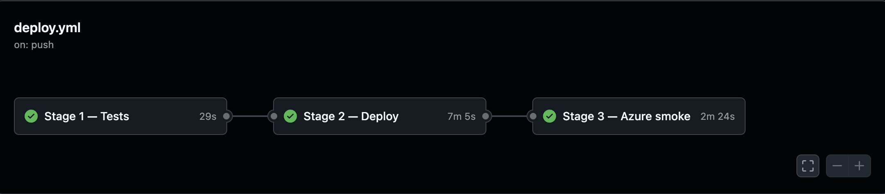

**Part 3 of 3 · Full-Stack Learning Series**

[Part 1 — From Terminal to Browser](blog1.md) covers taking the terminal Flappy Fish game to a React frontend — WebSockets, FastAPI and Flask, Docker, and the Azure SQL cold-start problem. [Part 2 — Optimizing the Flask API](blog2.md) profiles that auth API with cProfile and adds connection pooling to cut steady-state request latency.

# Shipping With Confidence

*The deploy said succeeded. The site showed the old UI. That's when I built a real pipeline.*

**Stack:** GitHub Actions · Azure Container Registry · Azure Container Instances · Python unittest · FastAPI · Flask

---

After Part 2, the app was faster and the architecture was solid. But deploying still meant pushing to `main`, manually rebuilding and pushing three images to ACR, refreshing the live URL, and hoping nothing broke. That's not confidence — it's optimism. So I built a pipeline that gives you an actual reason to trust a deploy.
 
## Making deploy wait for tests
 
A pipeline that always deploys is simple. A pipeline that only deploys when tests pass is useful.
 

 
Stage 2 has `needs: test`. If any test fails, deploy never starts. Pull requests run Stage 1 only — feedback without touching production.
 
```yaml
jobs:
  test:
    name: Stage 1 — Tests
    runs-on: ubuntu-latest
    steps:
     #Checkout code
     #Download dependencies
     #Run tests
  deploy:
    name: Stage 2 — Deploy
    needs: test
    steps:
      # build three images → push to ACR → az deployment group create
```
 
| Trigger | Stage 1 — Tests | Stage 2 — Deploy | Stage 3 — Smoke test |
| --- | --- | --- | --- |
| Pull request | ✅ | ❌ | ❌ |
| Push to `main` | ✅ | ✅ (if Stage 1 passes) | ✅ (if Stage 2 passes) |
| Manual `workflow_dispatch` | ✅ | ✅ (if Stage 1 passes) | ✅ (if Stage 2 passes) |
 
> **What I learned:** You don't need separate workflow files for tests and deploy — one pipeline with a `needs` dependency edge is enough to enforce correct order within the pipeline.
 
## What I actually tested — and how
 
The suite started as a checklist — class names and docstrings describing what each test *should* verify, with empty bodies skipped until implemented. That stub became the contract for the whole stack.

| Layer | What's tested | How | Runs in |
| --- | --- | --- | --- |
| Flask API | register, login, scores, delete, validation codes | Flask test client + mocked `pyodbc` | Stage 1 |
| Auth bridge | status-code mapping, wake-on-failure, leaderboard shape | Mocked `requests` | Stage 1 |
| Game server HTTP | `/auth/register`, `/auth/login`, `/leaderboard`, CORS | FastAPI `TestClient` | Stage 1 |
| WebSocket protocol | connect, frames, flap, quit, `game_over` | Scripted `run_game_headless` fakes | Stage 1 |
| Game logic | collision, scoring, headless loop, spawner | Direct unit tests on `game_logic.py` | Stage 1 |
| Regression guards | Dockerfile CMD, nginx routes, compose `BASE_URL`, deploy image tags | File content assertions | Stage 1 |
| Live E2E | register → login → leaderboard, WebSocket play, cold-start UX | HTTP/WS against deployed ACI URL | Stage 3 |
 
Most tests are fast, they do not need a network or database. The live E2E tests run separately in Stage 3, after the deploy is complete.

## Deploy-then-test, against the real thing, no local Docker needed

The setup I'd consider "correct" is very different from what I actually wrote: stand up a second ACI container group running the new image tags, point a load balancer at it, shift traffic over gradually while watching it, and only tear down the old group once the new one proves itself — that way a bad deploy never touches the users on the old, still-running version. I didn't build that. Running two container groups side by side means paying for both at once, even if only for a few minutes — real money for a project with no production traffic to justify it. So I picked the option that gets most of the safety without the extra resources: deploy in place, then immediately run the live smoke tests against it. It doesn't stop a bad deploy from being live for a moment; it does mean I find out within a couple of minutes instead of whenever I happen to refresh the page. Those live tests also don't need Docker Compose — neither my machine nor the CI runner runs it, and in production only nginx → game-server is public (`/auth/`, `/leaderboard`, `/ws/`) while Flask never is, so the tests just hit that same public surface directly:
 
```
http://flappy-fish.westus2.azurecontainer.io
```
 
That single URL exercises the full path: nginx proxy, FastAPI game server, auth bridge, Flask, Azure SQL. The test registers a throwaway user, logs in, confirms they appear on the leaderboard, opens a WebSocket and receives frames. If the database is cold, the test accepts a graceful JSON response — not a 502 from nginx.
 
 
> **What I learned:** E2E tests don't have to mean spinning up Compose locally. If production is already reachable, test through the same front door users hit. You're validating the wiring, not just individual containers in isolation.
 
## Why the deploy "worked" but nothing changed
 
Part 1 foreshadowed this. Deploys reported success. The live site still showed the old UI.
 
ACI caches images. If the ARM template says `frontend:latest` and the tag string doesn't change between deploys, Azure has no reason to pull a new layer — even when `:latest` in the registry now points somewhere else.
 
Fix: tag every build with the commit SHA and pass that tag into the deployment template.
 
```yaml
env:
  IMAGE_TAG: ${{ github.sha }}
 
# Build & push — both SHA and :latest
-t ${{ secrets.ACR_LOGIN_SERVER }}/frontend:${{ env.IMAGE_TAG }}
-t ${{ secrets.ACR_LOGIN_SERVER }}/frontend:latest
 
# Deploy — SHA tag forces ACI to pull the new image
--parameters frontendImage=frontend:${{ env.IMAGE_TAG }} \
             flaskApiImage=flask-api:${{ env.IMAGE_TAG }} \
             gameServerImage=game-server:${{ env.IMAGE_TAG }}
```
 
Then restart the container group to force the new image reference to load:
 
```yaml
- name: Restart container group
  run: |
    az container restart \
      --resource-group ${{ secrets.AZURE_RESOURCE_GROUP }} \
      --name flappy-fish
```
 
The regression suite checks for this explicitly — `deploy.yml` must contain `IMAGE_TAG: ${{ github.sha }}` and `frontendImage=frontend:${{ env.IMAGE_TAG }}`. A future edit that reverts to `:latest`-only will fail Stage 1 before it reaches production.
 
> **What I learned:** A successful deployment only means your pipeline didn't crash; it doesn't guarantee your users are using the new code. Using unique commit tags forces the server to load the new build, and automated tests ensure nothing breaks.
 
## The test that passed locally and failed in CI
 
The first CI run failed on `test_gravity_moves_player_down_without_input`. Locally it passed most of the time.
 
The test inferred the bird's vertical position by scanning the rendered buffer for yellow pixels (`#FFFF00`). The problem: pufferfish obstacles use the same color. Under load on GitHub's runner, the timing was different enough that the test locked onto an obstacle pixel instead of the player and compared the wrong Y values. It looked like a physics bug. It was a test bug.
 
Fix: wrap `render_frame` and record `player.position[1]` directly. Assert the bird falls after the jump apex — not that a buffer sample is below another buffer sample.
 
> **What I learned:** Flaky CI tests are test bugs, not random noise. Environment timing differences don't create flakiness; they expose underlying ambiguities. The right fix is resolving the timing issue, not auto-retrying until it passes.

## The smoke test problem I haven't fully solved

I discovered the sequencing the hard way. I deployed an intentionally broken version to test the pipeline — Stage 3 passed, because it was still testing the previous working deployment. Then I pushed a fix — Stage 3 failed, because now it was running against the broken version that had just gone live. Fixing the ordering solved *that* bug, but not the deeper one: there's still no way to smoke-test a new build before it replaces the old one, so a Stage 3 failure means production is already broken, and the only recovery today is a manual fix and re-deploy.

The proper fix would be an automatic rollback: Stage 3 fails, the pipeline triggers `az container update` with the last known-good SHA, and production reverts without manual intervention. That's next on the list.

> **What I learned:** Post-deployment smoke tests alert you when production is broken, but they don't stop users from seeing it — detection isn't the same as protection.
 
---

## The schema change problem I haven't solved either

Everything above assumes the shape of the data doesn't change — it doesn't cover what happens when it does. Say I decided `userid` should be a string instead of an int: nothing in this pipeline would catch that safely. There's no migration step in `deploy.yml`, no schema versioning, and Stage 1's mocked `pyodbc` tests would keep passing since the mocks reflect whatever type I hardcoded, not the real table; Stage 3 would only notice after the change is already live, and only if the mismatch happens to surface as an HTTP error. For now, a schema change is something I'd handle by hand, outside the pipeline entirely.

> **What I learned:** A test suite only catches what it was written to check. Mocking the database means schema drift between code and the real table is invisible until it's a production bug.

## Key takeaways
 
1. **One `needs: test` line is the gate.** If a test fails, the deploy doesn't run.
2. **Hit the live URL, not a local container.** If the real thing works, the wiring works.
3. **Mock the database for unit tests, save real network calls for smoke tests.** Two different jobs, two different tools.
4. **Don't deploy with `:latest`.** ACI won't pull a new image if the tag hasn't changed — use the commit SHA.
5. **Some of my tests just check that config files say what they should.** It sounds boring but it caught real mistakes.
6. **A test that passes locally and fails in CI is a bad test, not bad luck.** Fix it properly.
7. **Smoke tests after deploy tell you something broke — they don't stop users from seeing it.** A rollback step would close that gap, something to build next.
---
 
Three posts, one project. Part 1 was about making it work. Part 2 was about making it fast. Part 3 was about making it trustworthy. The game didn't change — but how I think about building and shipping software did.

*[GitHub](https://github.com/dhruv-kurpad/flappy-fish) · [Live demo](http://flappy-fish.westus2.azurecontainer.io)*